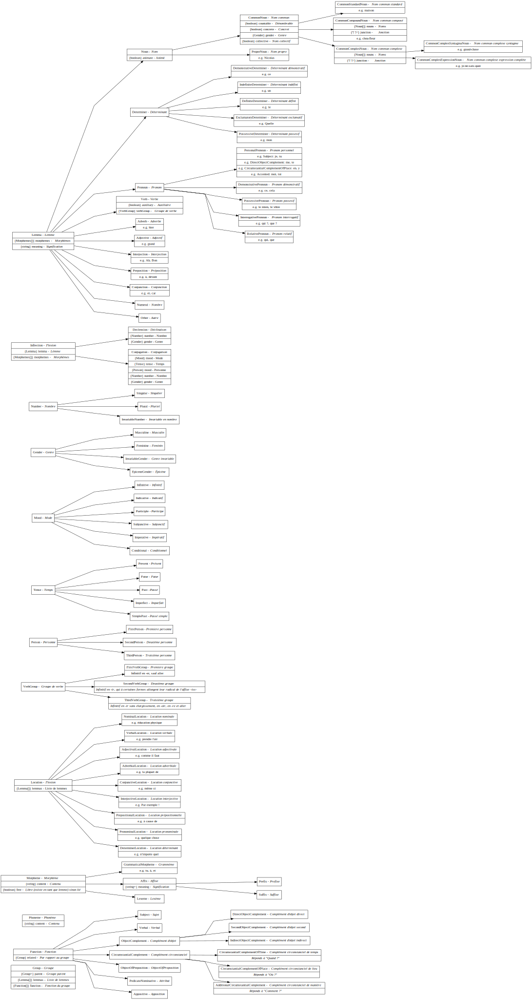

# French Linguistic Classification



## Build diagrams

```bash
npm run build
```

## Related

- [Kyubyong/mtp](https://github.com/Kyubyong/mtp) - Multi-lingual Text Processing

## Source

- [http://www.lattice.cnrs.fr/sites/itellier/poly_info_ling/index.html](http://www.lattice.cnrs.fr/sites/itellier/poly_info_ling/index.html)
- [https://repository.ortolang.fr/api/content/morphalou/3/LISEZ-MOI.html](https://repository.ortolang.fr/api/content/morphalou/3/LISEZ-MOI.html)
- [http://archive.sfl.cnrs.fr/sites/sfl/IMG/pdf/corr-Res-Sem1-12010.pdf](http://archive.sfl.cnrs.fr/sites/sfl/IMG/pdf/corr-Res-Sem1-12010.pdf), ([https://web.archive.org/web/20181222115223/http://archive.sfl.cnrs.fr:80/sites/sfl/IMG/pdf/corr-Res-Sem1-12010.pdf](web.archive.org snapshot on December 22, 2018, 11:52:23))

## License

This project is licensed under the [MIT license](LICENSE).
